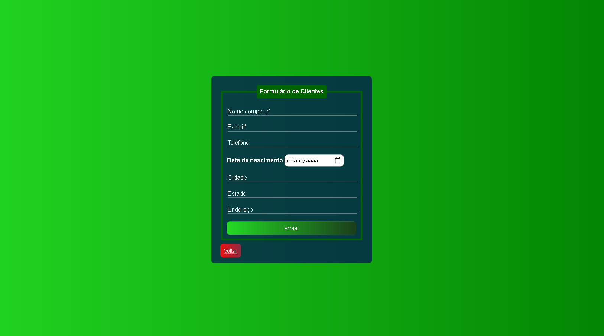

# Gestão de cadastros como segundo desafio Hiring Coders/ Gama Academy
## Criação de um sistema e-commerce para inventário de produtos e dados de clientes:
### Entregáveis:
<ul>
  <li>Os dados de clientes, endereços e produtos devem estar devidamente estruturados. Dados no localstorage</li>
  <li>Código fonte no github com o arquivo README detalhando as funcionalidades da programação</li>
</ul>

## Página inicial para escolher se deseja cadastrar clientes ou produtos

## Futuramente, este projeto migrará para utilizar as tecnologias React e NodeJS.

## O form de clientes cadastra:
<ul>
  <li>Nome Completo</li>
  <li>E-mail</li>
  <li>Telefone</li>
  <li>Data de Nascimento</li>
  <li>Cidade</li>
  <li>Estado</li>
  <li>Endereço</li>
</ul>

## O form de produtos cadastra:
<ul>
  <li>código</li>
  <li>nome</li>
  <li>Preço unitário</li>
  <li>Quantidade</li>
</ul>

